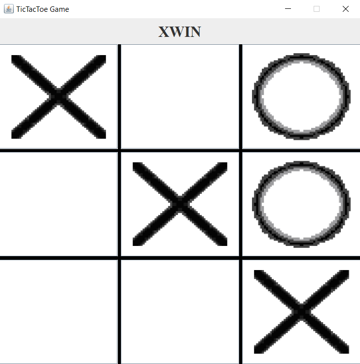
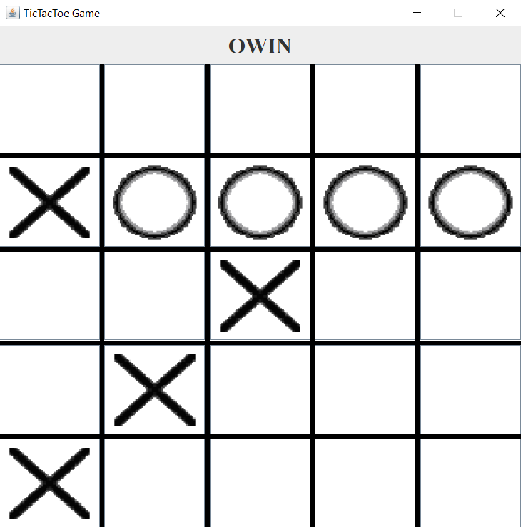
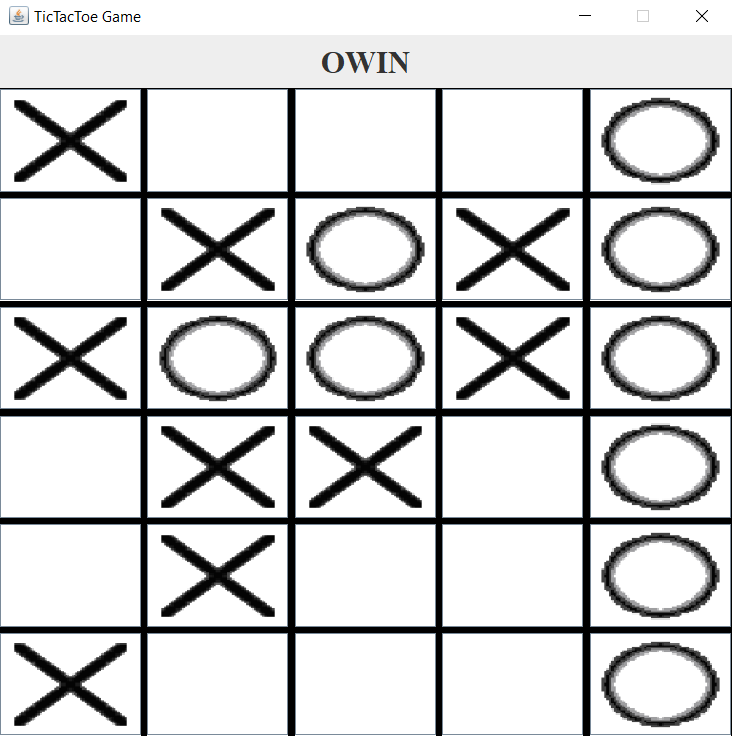

# TicTacToe Game :video_game:

## About The Project :blue_book:

In Winter 2022, I was taking a Java course and we had the complete a TicTacToe Game. To increase the difficulty of the homework, the game must be playable on any board size. The default board size is 3 squares by 3 squares and the first player to have 3 marks (up, down, across, or diagonally) is the winner. The homework implementation of the game must, however, be able to generate any board size prescribed by the user and also change the win size (the default is 3). The win size is how many consecutive marks (up, down, across, or diagonally) the player must have to win.

## What I did :writing_hand:

After completing the homework, I decided to go further. I took the game model (TicTacToeGame) and added two views and a controller. To explain, I took the existing game model, added an Interface called "View.java" and two classes that implement that interface named GraphicalView and TextView. As the name implies, the first one creates a GUI, and the latter prints the board on the terminal. I also created a controller, named TicTacToe, to initiate a game and control the game model and the views. The Main class has the main method to initialize the game. I also created the two images opting for a pixel "art" looking style.

## Examples
 






## Getting Started

1. The first step is to clone the repo

2. Compile the files

3. The game must now be run, ```<lines>``` is the number of rows desired, ```<column>``` is the number of columns desired, and ```<size win>``` is optional and the number of required consecutive marks to win. 
	* ``` java Main <lines> <column> <size win> ```
4.  Play the game! 

## Acknowledgments

Everything is written by me except the following files: CellValue and GameState were written by Professor Guy-Vincent Jourdan from the University of Ottawa. The TicTacToe Game was also an empty template from the same professor that we received when I started the homework. We had to use the existing method and implement them (they were empty). The line of code bellows the comments "// MY CODE HERE" in TicTacToeGame was written by myself. I also added two methods in that class named DiagonalArray and checkGameState.  


